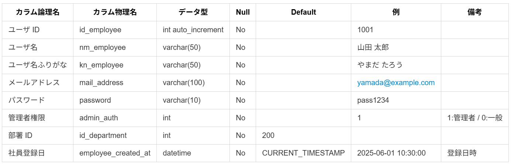
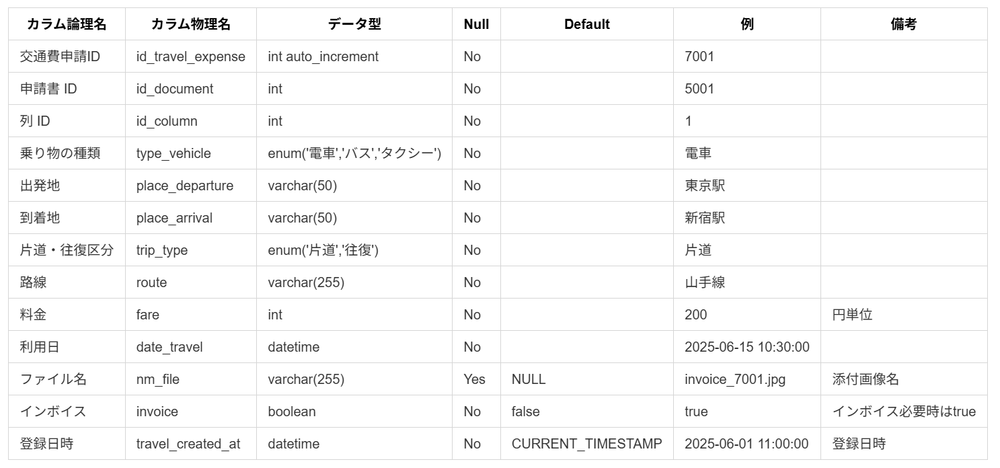
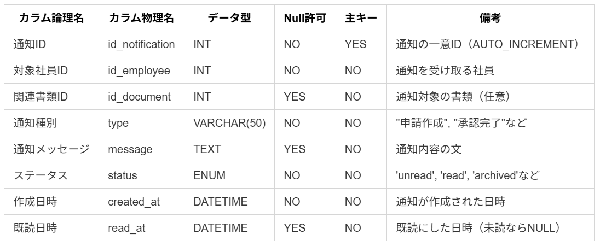

<!-- テーブル定義.md -->

# DBテーブル定義

 

# 社員マスタ

### テーブル名　: employee
### 主キー　 　: id_employee
### 外部キー　 : id_department

# 部署マスタ

### テーブル名　: department
### 主キー　 　: id_department

# 申請書種類マスタ

### テーブル名　: document_type
### 主キー　 　: id_document_type

# 申請書マスタ

### テーブル名　: document
### 主キー　 　: id_document
### 外部キー　 : id_document_typ / id_employee / id_approval / id_approved_by 

# 交通費申請マスタ

### テーブル名　: travel_expense
### 主キー　 　: id_travel_expense
### 外部キー　 : id_document / id_document_typ 

# 有給申請マスタ

### テーブル名　: paid_leave_request
### 主キー　 　: id_paid_leave_request
### 外部キー　 : id_document / id_document_typ 

# 交通費申請テンプレートマスタ

### テーブル名　: travel_expense_template
### 主キー　 　: id_template
### 外部キー　 : id_document / id_employee 

 
 
 
 
 
 
 

# 承認マスタ

### テーブル名　: approval
### 主キー　 　: id_approval
### 外部キー　 : id_document 

# 通知

### テーブル名：notification
### 主キー　 　: id_notification
### 外部キー　 : id_employee / id_document

