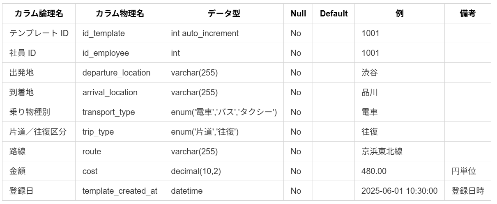

<!-- 目次.md -->
## 目次

1. 機能一覧
 

2. 画面遷移図
 

3. 画面レイアウト
 

4. DBテーブル定義
 

5. DB論理設計
 

6. DB物理設計
 

7. 実装計画

<!-- 機能一覧_基本設計.md -->
# 機能一覧

| 機能名                          | 機能概要                                                                 | 従業員 | 管理者 | 優先度 | 理由                                                                 |
|--------------------------------|--------------------------------------------------------------------------|--------|--------|--------|----------------------------------------------------------------------|
| ログイン機能                   | メールアドレスとパスワードでログインを行う機能。                            | 〇      | 〇      | 高     | システム利用の基本機能。                                              |
| ログアウト機能                 | ログアウトを行う機能。                                                    | 〇      | 〇      | 高     | セキュリティとセッション管理のために必須。                              |
| 交通費申請書入力機能           | 交通費申請書を入力できる機能。                                            | 〇      | 〇      | 高     | 主要な業務フローの一部であり、基本機能。                                |
| 交通費申請書送信機能           | 入力済みの交通費申請書を送信できる機能。                                  | 〇      | 〇      | 高     | 業務フローを完結させるために必要不可欠。                                |
| 有給申請書入力機能             | 有給申請書を入力できる機能。                                              | 〇      | 〇      | 高     | 主要な業務フローの一部であり、基本機能。                                |
| 有給申請書送信機能             | 入力済みの有給申請書を送信できる機能。                                    | 〇      | 〇      | 高     | 業務フローを完結させるために必要不可欠。                                |
| 申請一覧表示機能               | 全従業員の申請内容を一覧で確認できる機能。                                |        | 〇      | 高     | 主要な業務フローの一部。                                              |
| 申請承認・却下処理機能         | 申請内容を承認・却下に処理できる機能。                                    |        | 〇      | 高     | 管理者の主要業務であり、基本機能。                                      |
| 交通費申請書画像添付機能       | 交通費申請書に画像を添付できる機能。                                      | 〇      | 〇      | 中     | インボイス対応にする上で必須だが、初期段階では必須ではない。           |
| 交通費画像保存機能             | 添付した画像をローカルストレージに保存する機能。                            | 〇      | 〇      | 中     | ユーザー体験を向上させるが、必須ではない。                              |
| 交通費申請書テンプレート再利用機能 | 交通費申請書のテンプレートを再利用できる機能。                              | 〇      | 〇      | 中     | 業務効率を向上させるが、初期段階では必須ではない。                        |
| 提出済み申請一覧表示機能       | 自身が提出した申請の処理状況を一覧で確認できる機能。                        | 〇      | 〇      | 中     | 利便性を向上させるが、必須ではない。                                    |
| 提出済み申請詳細確認機能       | 自身が提出した申請の詳細を確認できる機能。                                | 〇      | 〇      | 中     | 利便性を向上させるが、必須ではない。                                    |
| 承認状況通知機能               | 自身が提出した申請の承認・却下の通知を受け取る機能。                        | 〇      | 〇      | 低     | ユーザー体験を向上させるが、初期段階では必須ではない。                    |
| 申請書分類機能                 | 申請書を分類できる機能。                                                  |        | 〇      | 低     | 業務効率を向上させるが、初期段階では優先度が低い。                        |
| 申請書通知機能                 | 従業員から申請書が提出された際に通知を受け取る機能。                        |        | 〇      | 低     | ユーザー体験を向上させるが、初期段階では必須ではない。                  |
| 入力値確認機能                 | 入力された値が求める形式に合っているか確認する機能。                        |        | 〇      | 低     | 実装時には必要だが初期段階では必須ではない。                  |
| エラーメッセージ表示機能機能                 | 不正な入力、画面遷移時にエラーメッセージを表示する機能。                                                  |        | 〇      | 低     | 実装時には必要だが、初期段階では必須ではない。                        |

<!-- テーブル定義画像.md -->
<!-- テーブル定義.md -->

# DBテーブル定義

 

# 社員マスタ

### テーブル名　: employee
### 主キー　 　: id_employee
### 外部キー　 : id_department

# 部署マスタ

### テーブル名　: department
### 主キー　 　: id_department

# 申請書種類マスタ

### テーブル名　: document_type
### 主キー　 　: id_document_type

# 申請書マスタ

### テーブル名　: document
### 主キー　 　: id_document
### 外部キー　 : id_document_typ / id_employee / id_approval / id_approved_by 

# 交通費申請マスタ

### テーブル名　: travel_expense
### 主キー　 　: id_travel_expense
### 外部キー　 : id_document / id_document_typ 

# 有給申請マスタ

### テーブル名　: paid_leave_request
### 主キー　 　: id_paid_leave_request
### 外部キー　 : id_document / id_document_typ 

# 交通費申請テンプレートマスタ

### テーブル名　: travel_expense_template
### 主キー　 　: id_template
### 外部キー　 : id_document / id_employee 

 
 
 
 
 
 
 

# 承認マスタ

### テーブル名　: approval
### 主キー　 　: id_approval
### 外部キー　 : id_document 

# 通知

### テーブル名：notification
### 主キー　 　: id_notification
### 外部キー　 : id_employee / id_document

<!-- 画面設計.md -->
# 画面設計

## 画面遷移図

- 詳細は別添ファイル「画面遷移図_簡易.pdf」をご参照ください。

## 画面レイアウト

- 詳細は別添ファイル「画面遷移図_詳細.pdf」をご参照ください。

<!-- ER図.md -->
# ER図論理

 
 
 
 
 
 
 
 
 
 
 
 
 
 

# ER図物理

<!-- 実装計画.md -->
# 実装スケジュール（2025年6月23日〜24日）【5人チーム／実装作業のみ】

## チーム体制
- 雨笠
- 長妻
- 成田
- 樋口
- 三浦

---

## 6月23日（月）

### 午前（09:00〜12:00）
| 担当者 | タスク                                      | 優先度 |
|--------|---------------------------------------------|--------|
| 雨笠     | ログイン機能                                 | 高     |
| 長妻      | ログアウト機能                               | 高     |
| 成田      | ロール認可（管理者／従業員）                  | 高     |
| 樋口      | 交通費申請書入力機能                         | 高     |
| 三浦      | 有給申請書入力機能                           | 高     |

---

### 午後前半（13:00〜15:00）
| 担当者 | タスク                                      | 優先度 |
|--------|---------------------------------------------|--------|
| 雨笠     | 交通費申請書送信機能                         | 高     |
| 長妻      | 有給申請書送信機能                           | 高     |
| 成田      | 申請一覧表示機能（管理者）                   | 高     |
| 樋口      | 申請承認・却下処理機能                       | 高     |
| 三浦      | 提出済み申請一覧表示機能（従業員）            | 中     |

---

### 午後後半（15:00〜17:30）
| 担当者 | タスク                                      | 優先度 |
|--------|---------------------------------------------|--------|
| 雨笠     | 提出済み申請詳細確認機能（従業員）            | 中     |
| 長妻      | 交通費申請書画像添付機能                     | 中     |
| 成田      | 交通費画像保存機能                           | 中     |
| 樋口      | 交通費テンプレート再利用機能                 | 中     |
| 三浦      | 有給申請書再利用機能（※必要であれば対応）     | 中     |

---

## 6月24日（火）

### 午前（09:00〜12:00）
| 担当者 | タスク                                      | 優先度 |
|--------|---------------------------------------------|--------|
| 雨笠      | 申請書分類機能（管理者向け）                 | 低     |
| 長妻      | 申請書通知機能（管理者向け）                 | 低     |
| 成田      | 承認状況通知機能（従業員向け）                | 低     |
| 樋口      | バリデーション（必須入力・形式チェックなど）   | 全般   |
| 三浦      | エラー表示・メッセージ処理                   | 全般   |

---

### 午後前半（13:00〜15:00）
| 担当者 | タスク                                      | 優先度 |
|--------|---------------------------------------------|--------|
| 雨笠      | UI／画面整理（管理者機能側）           | 全般   |
| 長妻      |   UI／画面整理（従業員機能側）   | 全般   |
| 成田      |   画面遷移の微調整／共通レイアウト整理　        | 全般   |
| 樋口     | ファイルアップロードUI改善（画像添付用）       | 全般   |
| 三浦      | ボタン配置・レスポンシブ調整                  | 全般   |

---

### 午後後半（15:00〜17:30）
| 担当者 | タスク                                      | 優先度 |
|--------|---------------------------------------------|--------|
| 全員    | 実装機能の最終確認とソース整理                | 全般   |
|        | - フォルダ構成・リファクタリング等   |        |

