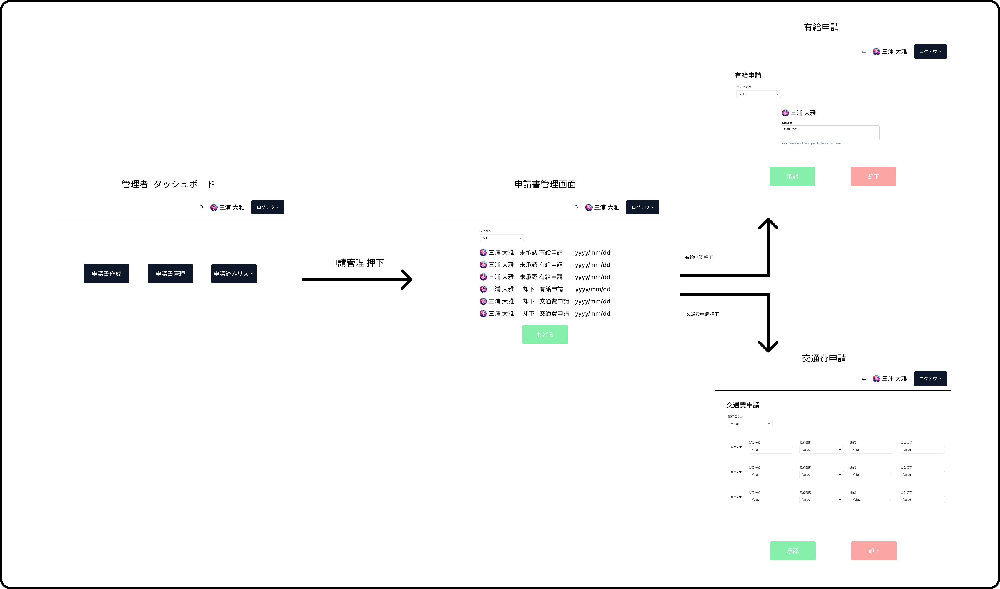

 

# 利用シーン（業務フロー）

本システムは、一般社員（申請者）が申請書を作成し、管理職（承認者）がそれを確認・承認するという一連の業務フローを、Webアプリケーション上で完結できるように設計されている。

##  主な業務フロー　

- ログイン画面からログインした後を想定　

### 1. 申請者による申請書作成例

- ※交通費申請書の場合、事前にテンプレート作成済み

1. ログイン後、トップ画面の「申請書作成」、「申請済みリスト」のうち「申請書作成」を選択
2. 「申請書作成」メニューから以下の申請種別を選択
   - 有給
   - 交通費
   - テンプレート作成
3. 「交通費」を選択。選択した申請種別に応じた入力フォームが表示される
4. テンプレートを適用させたい範囲を選択し、「テンプレートを適用」を押下
5. 必要に応じてインボイス適用対象かの選択、画像の添付。
6. 申請内容を入力し、提出ボタンを選択
7. 確認画面で内容を確認後、「確定」ボタンを押下して提出
6. 申請は承認者に通知されると同時に、申請者の「申請済みリスト」に登録される

### 2. 管理者による確認・承認

1. 管理者がログイン後、トップ画面の「申請書作成」、「申請済みリスト」、「申請書管理」のうち「申請書管理」を選択
2. 提出された申請書一覧から対象の申請書を選択し、詳細を確認
3. 内容を確認後、「承認」、「却下」を選択
4. 承認結果は申請者に通知され、履歴として双方に保存される

 
 
 
 
 
 
 
 
 

###  モバイル利用シーン

- 申請者は出張先や外出先からスマートフォンを利用して、即時に交通費申請が可能
- 承認者は移動中でもスマートフォンから申請内容を確認し、承認処理を行える
- UIはレスポンシブ対応されており、小さい画面でも快適な操作性を実現

### テンプレート活用シーン

- 頻繁に発生する申請（例：月末の交通費精算）については、テンプレートとして保存可能
- 次回以降はテンプレートを呼び出すだけで、入力作業の大部分を省略できる
- 各申請書につき1つのテンプレートが利用可能

---
