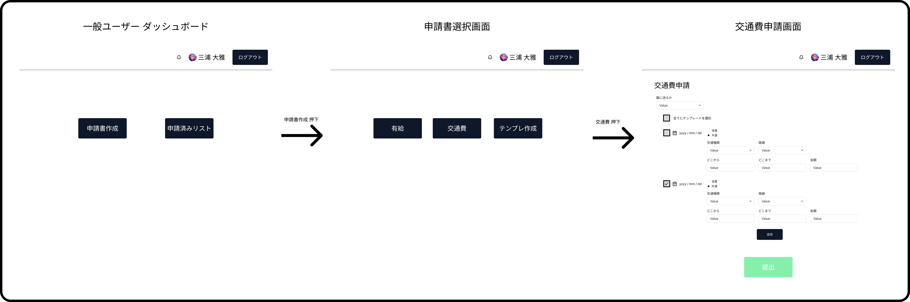
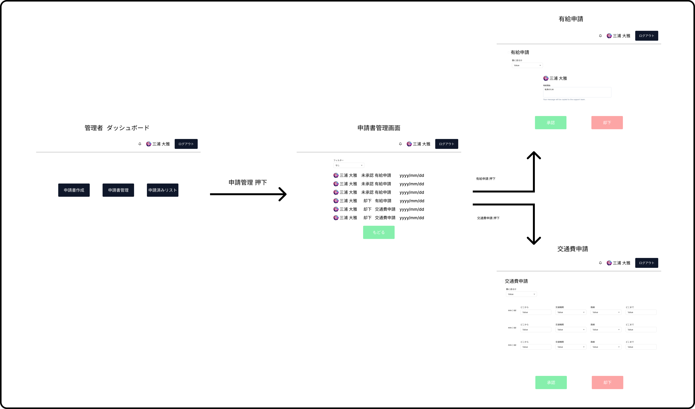
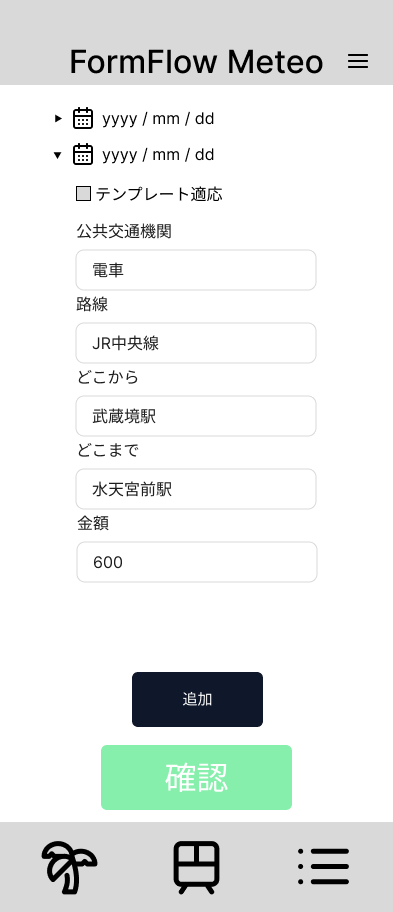
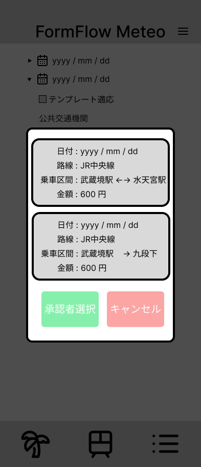
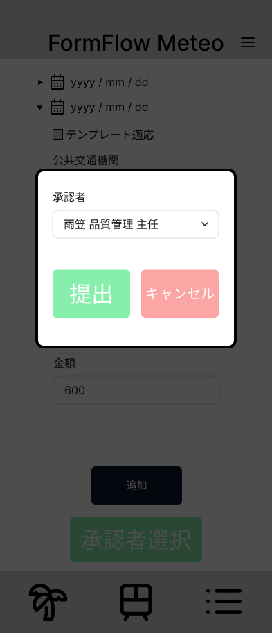

<!-- 目次.md -->
## 目次

1. システム名・作成物
 

2. プロジェクト名
 

3. システム概要
 

4. 背景・目的
 

5. 対象ユーザー
 

6. システムで提供できること
 

7. 利用シーン（業務フロー）
 

8. 開発スケジュール
 

9. 機能要件
 

10. 非機能要件
 

11. 制約条件
 

12. 開発範囲
 

13. コスト
 

<!-- 2-システム名・作成物.md -->
 

# システム名・作成物

**FormFlow Meteo**

<!-- 4-プロジェクト名.md -->
 
 

# プロジェクト名

申請書管理システム

<!-- 1-システム概要.md -->
# システム概要

本システムは、企業や団体における「交通費申請」「有給申請」の定型的な申請業務を対象とした、Webベースの申請書管理システムである。従業員による申請書の作成・送信、管理者による承認・却下といった一連の業務フローを、PCおよびスマートフォンから操作可能なインターフェース上で完結させることで、業務の効率化の向上を実現する。

## 特徴

- **申請業務の一元管理**
  - 交通費・有給などの各種申請書を統一された操作画面上で管理可能。
  - 申請履歴、承認状況、差戻し理由の確認機能を標準搭載。

- **再利用可能なテンプレート機能**
  - 申請者は過去の申請内容をテンプレートとして保存・再利用できる。
  - 頻繁に利用される申請書について、入力作業の省力化が可能。

- **マルチデバイス対応**
  - PC（Windows）、スマートフォンでの利用を想定。

- **セキュリティ対応**
  - ログイン認証機能（ID・パスワード）
  - 従業員と管理者のユーザーごとに分けた権限設定

- **従業員管理システムとの連携性**
  - 自社が提供する従業員管理システムとの連携を前提とした設計構造

- **電子帳簿保存法・インボイス考慮**
  - 承認済み書類の削除、更新の防止
  - 可視性（検索・閲覧機能）を確保
  - 交通費申請時に画像の保存が可能

## 導入効果

- 手作業による申請書作成や承認業務にかかる作業時間を削減。
- 誤記や漏れの防止により、申請書の精度を向上。
- 承認処理のステータスが可視化され、業務の進捗管理が容易になる。

## 対象業務範囲

- 交通費申請
- 有給申請
- 承認処理および差戻し対応
- 申請履歴の閲覧・検索

本システムは、申請業務の標準化・効率化と情報の集約管理を実現するための業務基盤として導入される。

<!-- 3-背景・目的.md -->
 
 

# 背景・目的

現状、申請書の作成および管理業務はExcelを用いて個別に実施されており、申請種別・担当者ごとの管理が煩雑である。また、既存の申請管理ツールについても以下のような問題がある。

- UIが不十分で画面が小さく視認性・操作性に欠ける
- 申請内容のテンプレートが存在しないため、毎回入力作業が発生して非効率
- スマートフォンでは操作しづらく、一部機能が制限されるなど利便性に課題
- 通知機能が不十分で、重要な申請の確認漏れが発生
- 操作マニュアルがないと扱いづらいなど、利用者にとって直感的でないUI設計

これらの課題を解決するために、新たに**直感的かつ操作性に優れた申請書作成・管理システム**を開発することを目的とする。

新システムでは、申請内容の分類・入力・確認・一覧管理などの一連の操作をWebアプリケーション上で完結でき、テンプレート活用による作業効率化やスマートフォン対応による利便性向上、視認性を意識したデザインによって、申請業務全体の効率化と正確性向上を図る。

---

<!-- 5-対象ユーザー.md -->
 
 

# 対象ユーザー

本システムの主な対象ユーザーは以下の通り：

### 導入対象企業

- 社内において交通費精算や有給申請などの各種申請業務を日常的に行っている**中小〜中堅企業**
- Excelや簡易的なツールで申請管理を行っており、**申請の効率化・標準化・可視化**を求めている企業

 

### 一般社員（申請者）

- 交通費や有給休暇など、各種申請書を作成・提出するユーザー
- 申請履歴の確認や、テンプレートを活用した迅速な申請書作成を求める
- PCだけでなくモバイルからも直感的に操作できるUIを必要とする

### 承認者（管理職）

- 所属メンバーの申請内容を確認・承認する役割を担うユーザー
- 一覧表示や詳細確認、承認処理を効率的に行える操作性が求められる
- 重要な申請を見逃さないための通知機能が必要

<!-- 6-システムで提供できること.md -->
#  システムで提供すること

- 申請者が簡単に使える申請作成・提出機能

    - 交通費入力テンプレート
        - よく使う乗車区間をテンプレートとして保存・再利用可能
        - テンプレート選択で入力工数を削減

    - 直感的なUI
        - PC・スマホ両方に対応したレスポンシブデザイン
        - フォーマットに沿って順に入力できる構成

- 承認・確認作業を効率化する機能

    - 承認・保留・却下などのステータス管理
        - 一覧画面で処理状況を即座に把握可能
        - 絞り込み・検索で過去の申請もすぐに確認

    - 通知機能
        - 承認待ち・却下などのステータスに応じて通知

- 管理者による申請管理の利便性向上

    - 申請データの一括管理機能
        - ユーザーや部署単位でのフィルタリング機能

<!-- 7-利用シーン（業務フロー）.md -->
 

# 利用シーン（業務フロー）

本システムは、一般社員（申請者）が申請書を作成し、管理職（承認者）がそれを確認・承認するという一連の業務フローを、Webアプリケーション上で完結できるように設計されている。

##  主な業務フロー　

- ログイン画面からログインした後を想定　

### 1. 申請者による申請書作成例

- ※交通費申請書の場合、事前にテンプレート作成済み

1. ログイン後、トップ画面の「申請書作成」、「申請済みリスト」のうち「申請書作成」を選択
2. 「申請書作成」メニューから以下の申請種別を選択
   - 有給
   - 交通費
   - テンプレート作成
3. 「交通費」を選択。選択した申請種別に応じた入力フォームが表示される
4. テンプレートを適用させたい範囲を選択し、「テンプレートを適用」を押下
5. 必要に応じてインボイス適用対象かの選択、画像の添付。
6. 申請内容を入力し、提出ボタンを選択
7. 確認画面で内容を確認後、「確定」ボタンを押下して提出
6. 申請は承認者に通知されると同時に、申請者の「申請済みリスト」に登録される

### 2. 管理者による確認・承認

1. 管理者がログイン後、トップ画面の「申請書作成」、「申請済みリスト」、「申請書管理」のうち「申請書管理」を選択
2. 提出された申請書一覧から対象の申請書を選択し、詳細を確認
3. 内容を確認後、「承認」、「却下」を選択
4. 承認結果は申請者に通知され、履歴として双方に保存される

 
 
 
 
 
 
 
 
 

###  モバイル利用シーン

- 申請者は出張先や外出先からスマートフォンを利用して、即時に交通費申請が可能
- 承認者は移動中でもスマートフォンから申請内容を確認し、承認処理を行える
- UIはレスポンシブ対応されており、小さい画面でも快適な操作性を実現

### テンプレート活用シーン

- 頻繁に発生する申請（例：月末の交通費精算）については、テンプレートとして保存可能
- 次回以降はテンプレートを呼び出すだけで、入力作業の大部分を省略できる
- 各申請書につき1つのテンプレートが利用可能

---

<!-- 8-開発スケジュール.md -->
# 開発スケジュール

## Spring Boot チーム開発スケジュール（2025年6月）

### 概要
- **目的**：Spring Bootを用いたWebアプリケーションのチーム開発演習
- **期間**：2025年6月13日（金）〜 6月26日（木）
- **工程**：要件定義 → 設計 → 実装 → テスト → 納品

---

### スケジュール詳細

| 日付 | 午前作業 | 午後作業 |
|------|----------|------|
 6月13日（金） | 企画・構想 | 要件定義 |
| 6月16日（月） | 要件定義書作成 | 要件定義書作成 |
| 6月17日（火） | 要件定義書作成 | 要件定義書作成 |
| 6月18日（水） | 要件定義書作成 | 要件定義書作成 |
| 6月19日（木） | 基本設計書作成 | 基本設計書作成 |
| 6月20日（金） | 基本設計書作成 | 基本設計書作成 |
| 6月23日（月） | プログラム作成 | プログラム作成 |
| 6月24日（火） | プログラム作成 | プログラム作成 |
| 6月25日（水） | 単体テスト、結合テスト|単体テスト、結合テスト|
| 6月26日（木） | 納品 |  |

---

<!-- 9-機能要件.md -->
# 機能要件

## 共通機能要件

| 利用者区分 | 機能名             | 機能の詳細説明 |
|------------|------------------|----------------|
| 共通   | ログイン機能     | 交通費申請書を入力できる機能 |
| 共通   | ログアウト機能     | 入力済みの交通費申請書を送信できる機能。 |
| 共通   | 交通費申請書入力機能     | 交通費申請書を入力できる機能。 |
| 共通   | 交通費申請書画像添付機能     | 交通費申請書に画像を添付できる機能。 |
| 共通   | 交通費画像保存機能 | 添付した画像をローカルストレージに保存する機能。 |
| 共通   | 交通費申請書送信機能     | 入力済みの交通費申請書を送信できる機能。 |
| 共通   | 交通費申請書テンプレート再利用機能 | 交通費申請書のテンプレートを再利用できる機能。各申請書につき1つのテンプレートが利用可能。 |
| 共通   | 有給申請書入力機能     | 有給申請書を入力できる機能。 |
| 共通   | 有給申請書送信機能     | 入力済みの有給申請書を送信できる機能。 |
| 共通   | 承認状況通知機能 | 自身が提出した申請の承認・却下の通知を受け取る機能。 |

## 従業員用機能要件

| 利用者区分 | 機能名             | 機能の詳細説明 |
|------------|------------------|----------------|
| 従業員用   | 提出済み申請一覧表示機能 | 自身が提出した申請の処理状況を一覧で確認できる機能。 |
| 従業員用   | 提出済み申請詳細確認機能 | 自身が提出した申請の詳細を確認できる機能。 |

## 管理者用機能要件
| 利用者区分 | 機能名             | 機能の詳細説明 |
|------------|------------------|----------------|
| 管理者用   | 全従業員申請一覧表示機能 | 全従業員の申請内容を一覧で確認できる機能。 |
| 管理者用   | 申請承認・却下処理機能 | 申請内容を承認・却下に処理できる機能。 |
| 管理者用   | 申請履歴管理機能     | 申請履歴を管理できる機能。 |
| 管理者用   | 申請書分類機能       | 申請書を分類できる機能。 |
| 管理者用   | 申請書通知機能 | 従業員から申請書が提出された際に通知を受け取る機能。 |

<!-- 10-非機能要件.md -->
# 非機能要件

##  操作性

- 直感的に操作できる**シンプルなUI**を提供することをコンセプトとする
  - スマートフォンでも快適に操作可能なレスポンシブ対応とする

##  セキュリティ

- 管理者権限の付与機能を提供

## 画像保存形式
- Jpeg, PNG, PDF

##  移植性

- **Java 17 以上**を使用

<!-- 11-制約条件.md -->
 

#  制約条件

本システムの開発における技術的制約は以下の通りとする。

## フロントエンド

- 使用技術：HTML、JavaScript、CSS

## バックエンド

- 使用言語：Java 17
- フレームワーク：Spring Boot 3.5

## データベース

- 管理システム：MySQL
- ローカルファイル

<!-- 13-開発範囲.md -->

# 開発範囲

##  システム化対象項目

- 交通費申請
- 有給申請
- 承認処理および却下対応
- 申請履歴の閲覧・検索

 
 

##  システム化対象外項目

- 従業員管理システム
- 申請書フォーマットの新規作成・変更・削除機能（電子帳簿保存法のため）

<!-- 12-コスト.md -->
 
 

# コスト

## 開発費用試算
- 工数 : 2.5人月
- 開発費用 : **1,250,000円**
---

